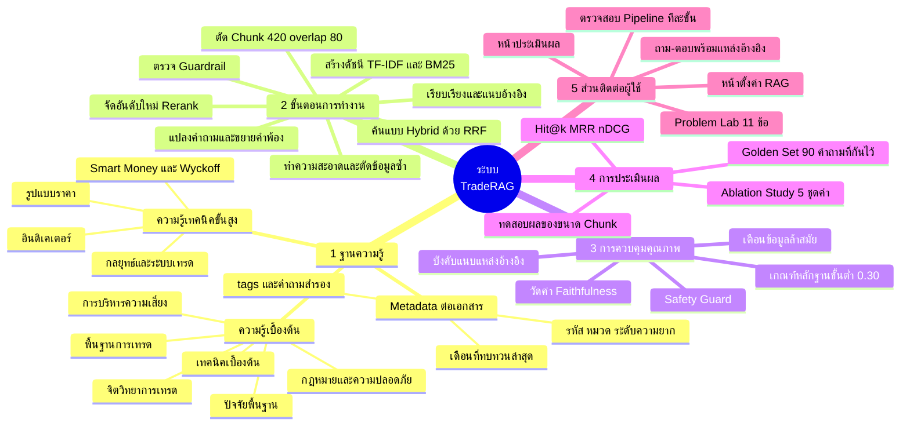
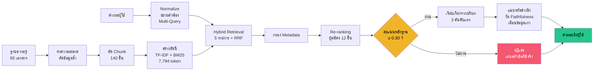
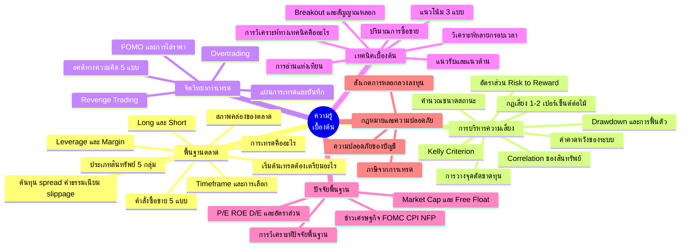
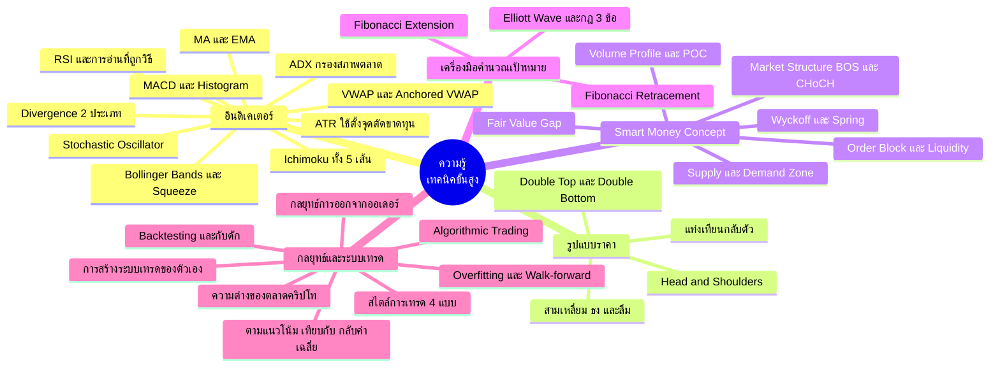
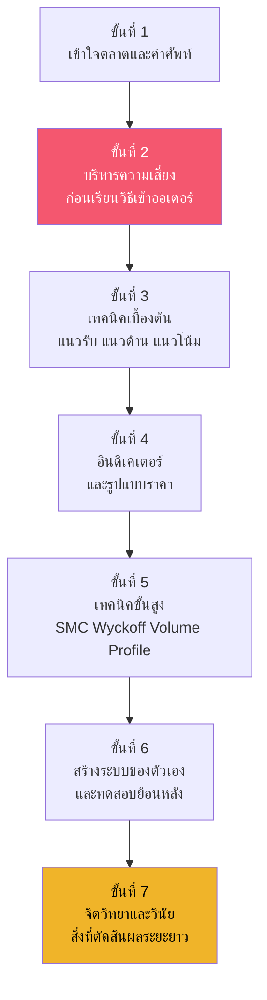
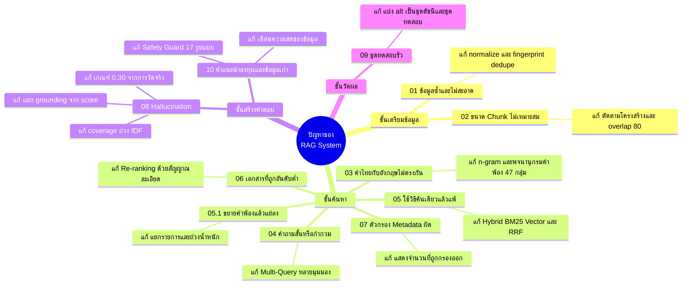
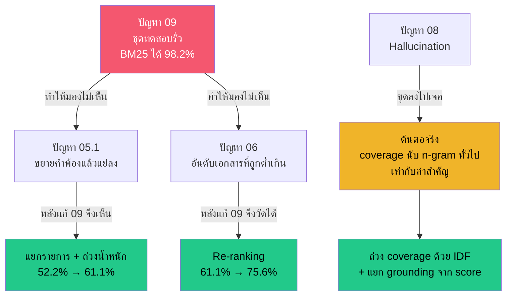
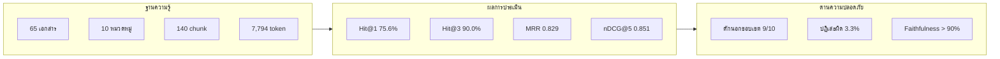

# Mind Map — ภาพรวมระบบและแผนที่ความรู้

**LAB 3 — DL-05 RAG System Development II**

มี 3 แผนที่ ดูแบบโต้ตอบได้ในหน้าเว็บ แท็บ **ภาพรวมระบบ**

1. [โครงสร้างระบบ TradeRAG](#1-โครงสร้างระบบ-traderag)
2. [แผนที่ความรู้การเทรด](#2-แผนที่ความรู้การเทรด) — เบื้องต้น + เทคนิคขั้นสูง
3. [แผนที่ปัญหาและการแก้ไข](#3-แผนที่ปัญหาและการแก้ไข)

---

## 1. โครงสร้างระบบ TradeRAG

### เส้นทางข้อมูลจากต้นจนจบ

---

## 2. แผนที่ความรู้การเทรด

แบ่งเป็น 2 ชั้น คือความรู้ที่ต้องรู้ก่อนลงสนาม และความรู้เทคนิคสำหรับผู้ที่ผ่านพื้นฐานแล้ว

### 2.1 ความรู้เบื้องต้น

### 2.2 ความรู้เทคนิคขั้นสูง

### 2.3 ลำดับการเรียนรู้ที่แนะนำ

> **หมายเหตุ:** การบริหารความเสี่ยงอยู่ก่อนเทคนิคโดยตั้งใจ
> เพราะระบบที่วิเคราะห์เก่งแต่คุมความเสี่ยงไม่เป็น จะหมดพอร์ตก่อนที่ความแม่นยำจะมีความหมาย

---

## 3. แผนที่ปัญหาและการแก้ไข

### ความเชื่อมโยง: ปัญหาหนึ่งบังหน้าอีกปัญหาหนึ่ง

**สิ่งที่แผนภาพนี้บอก:** ปัญหา 09 (ชุดทดสอบรั่ว) ไม่ได้เป็นแค่ปัญหาหนึ่งข้อ
แต่มันบังไม่ให้เห็นปัญหา 05.1 และ 06 ด้วย เพราะเมื่อคะแนนเกือบเต็มอยู่แล้ว
ก็ไม่มีช่องว่างให้เห็นว่าเทคนิคใดช่วยหรือไม่ช่วย
**การแก้ปัญหาเรื่องการวัดผลจึงต้องมาก่อนการปรับแต่งระบบเสมอ**

---

## 4. สรุปตัวเลขสำคัญของระบบ

