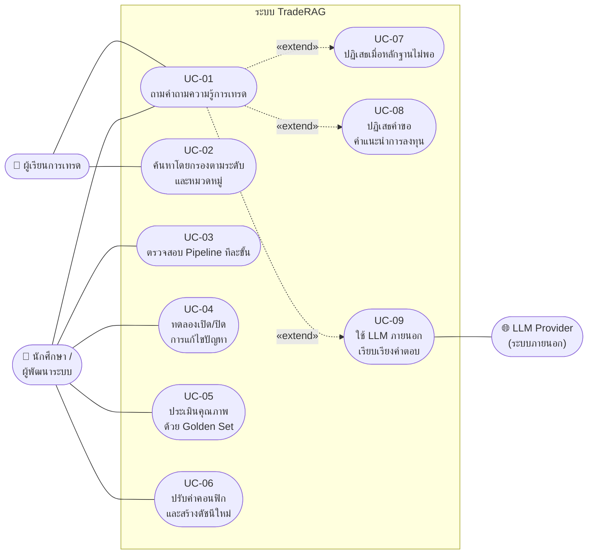
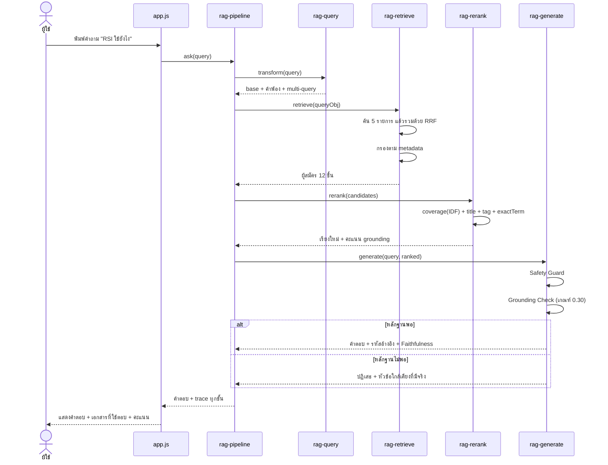

# Use Case ของระบบ TradeRAG

**LAB 3 — DL-05 RAG System Development II**

เอกสารนี้อธิบายระบบในมุมของผู้ใช้งาน ตั้งแต่แผนภาพภาพรวม
ไปจนถึงรายละเอียดการทำงานทีละขั้นของแต่ละกรณีใช้งาน
ทุก Use Case ระบุตำแหน่งใน Source Code ที่ทำงานจริง

---

## 1. ผู้เกี่ยวข้องกับระบบ (Actors)

| Actor | ประเภท | บทบาท |
|-------|--------|-------|
| **ผู้เรียนการเทรด** | ผู้ใช้หลัก | ถามคำถามเพื่อหาความรู้ ตั้งแต่พื้นฐานถึงเทคนิคขั้นสูง |
| **นักศึกษา / ผู้พัฒนาระบบ** | ผู้ดูแล | ตรวจสอบการทำงาน ทดลองแก้ปัญหา ประเมินคุณภาพ และปรับค่าคอนฟิก |
| **ระบบ (Guardrail)** | Actor ภายใน | ตัดสินใจปฏิเสธคำถามที่ไม่มีหลักฐาน หรือที่เกินขอบเขต |
| **LLM Provider** | ระบบภายนอก | เรียบเรียงคำตอบจากบริบท (ทางเลือก ปิดไว้เป็นค่าเริ่มต้น) |

---

## 2. แผนภาพ Use Case Diagram

> แผนภาพเดียวกันนี้แสดงเป็น SVG แบบโต้ตอบได้ในหน้าเว็บ แท็บ **Use Case**

---

## 3. ความสัมพันธ์ระหว่าง Use Case

| ความสัมพันธ์ | ความหมายในระบบนี้ |
|-------------|-------------------|
| UC-07 `extend` UC-01 | ขยายการทำงานของ UC-01 **เมื่อคะแนนหลักฐานต่ำกว่าเกณฑ์** ทำให้ขั้นตอนสร้างคำตอบถูกแทนที่ด้วยการปฏิเสธ |
| UC-08 `extend` UC-01 | ขยายการทำงานของ UC-01 **เมื่อคำถามเข้าเงื่อนไขขอคำแนะนำรายบุคคล** โดยดักก่อนเข้าขั้นตอนค้นหา |
| UC-09 `extend` UC-01 | ขยายการทำงานของ UC-01 **เมื่อเปิดโหมด LLM** โดยแทนที่เฉพาะขั้นตอนเรียบเรียงคำตอบ ส่วนขั้นค้นหายังเหมือนเดิม |

---

## 4. รายละเอียด Use Case

### UC-01 — ถามคำถามความรู้การเทรด

| หัวข้อ | รายละเอียด |
|--------|-----------|
| **ผู้กระทำ** | ผู้เรียนการเทรด |
| **เป้าหมาย** | ได้คำตอบที่อ้างอิงจากฐานความรู้ พร้อมแหล่งที่มาที่ตรวจสอบย้อนกลับได้ |
| **ความสำคัญ** | สูงสุด (Core Use Case) |
| **เงื่อนไขก่อนเริ่ม** | ระบบสร้างดัชนีเสร็จแล้ว |
| **จุดเริ่มทำงาน** | ผู้ใช้พิมพ์คำถามแล้วกดส่ง หรือกดคำถามแนะนำ |
| **ผลลัพธ์เมื่อจบ** | ผู้ใช้ได้คำตอบพร้อมรหัสเอกสารอ้างอิง หรือได้ข้อความปฏิเสธที่ระบุเหตุผลชัดเจน |

**ลำดับการทำงานหลัก (Main Flow)**

| # | ผู้กระทำ | การกระทำ |
|---|---------|----------|
| 1 | ผู้ใช้ | พิมพ์คำถาม เช่น "RSI ใช้ยังไง" แล้วกดส่ง |
| 2 | ระบบ | ตรวจ Safety Guard ว่าเป็นคำขอคำแนะนำรายบุคคลหรือไม่ *(ถ้าใช่ → UC-08)* |
| 3 | ระบบ | ทำ Query Transformation: normalize → ขยายคำพ้องไทย-อังกฤษ → สร้าง Multi-Query |
| 4 | ระบบ | ค้นแบบ Hybrid ด้วย 5 รายการ (คำถามเดิม / คำพ้อง / multi-query × BM25, Vector) แล้วรวมอันดับด้วย RRF |
| 5 | ระบบ | กรองผลลัพธ์ตาม metadata ที่ผู้ใช้ตั้งไว้ |
| 6 | ระบบ | จัดอันดับใหม่ด้วย coverage, title match, tag match, exact term |
| 7 | ระบบ | ตรวจคะแนนหลักฐานของอันดับหนึ่งเทียบเกณฑ์ 0.30 *(ถ้าต่ำกว่า → UC-07)* |
| 8 | ระบบ | เรียบเรียงคำตอบจากเอกสาร 3 อันดับแรกเท่านั้น แล้วแนบรหัสอ้างอิง |
| 9 | ระบบ | คำนวณ Faithfulness และตรวจความสดของข้อมูล |
| 10 | ระบบ | แสดงคำตอบ พร้อมรายการเอกสารที่ใช้ตอบและคะแนนในแถบด้านขวา |

**ทางเลือกอื่น (Alternate Flow)**
- **3ก.** ถ้าปิดการขยายคำพ้อง ระบบค้นด้วยคำเดิมเท่านั้น ซึ่งอาจหาไม่เจอเมื่อผู้ใช้ใช้คำไทยแต่เอกสารเขียนอังกฤษ
- **4ก.** ถ้าผู้ใช้เลือกวิธีค้นเป็น BM25 หรือ Vector อย่างเดียว ระบบจะไม่สร้างรายการของอีกวิธี
- **6ก.** ถ้าปิด Re-ranking ระบบใช้อันดับจากชั้นค้นหาโดยตรง แต่ยังคำนวณคะแนนหลักฐานตามปกติ
- **8ก.** ถ้าเปิดโหมด LLM จริง ระบบส่งบริบทไปให้ LLM เรียบเรียงแทน *(→ UC-09)*

**กรณีผิดปกติ (Exception Flow)**
- **E1.** ไม่พบเอกสารที่เกี่ยวข้องเลย → แจ้งว่าไม่พบข้อมูล พร้อมแนะนำคำสำคัญที่มีในฐานความรู้
- **E2.** คะแนนหลักฐานต่ำกว่าเกณฑ์ → ปฏิเสธและเสนอหัวข้อใกล้เคียงที่มีอยู่จริง
- **E3.** ตัวกรอง metadata แคบเกินจนไม่เหลือผลลัพธ์ → แจ้งจำนวนที่ถูกกรองออกให้ผู้ใช้ปรับ

**กฎทางธุรกิจ**
1. ห้ามตอบด้วยข้อมูลนอกฐานความรู้เด็ดขาด
2. ทุกคำตอบต้องมีรหัสเอกสารอ้างอิงเมื่อเปิด `REQUIRE_CITATION`
3. ถ้าไม่มีหลักฐานเพียงพอ ต้องปฏิเสธ ไม่ใช่เดา

**Source Code:** `app.js → handleAsk()` | `rag-pipeline.js → ask()`

---

### UC-02 — ค้นหาโดยกรองตามระดับความยากและหมวดหมู่

| หัวข้อ | รายละเอียด |
|--------|-----------|
| **ผู้กระทำ** | ผู้เรียนการเทรด |
| **เป้าหมาย** | จำกัดคำตอบให้อยู่ในระดับความรู้ที่ตัวเองรับไหว |
| **เงื่อนไขก่อนเริ่ม** | เอกสารทุกชิ้นมี metadata ครบ |
| **ผลลัพธ์เมื่อจบ** | ผลการค้นหาถูกจำกัดตามเงื่อนไข และระบบรายงานจำนวนที่ถูกกรองออก |

**Main Flow**
1. ผู้ใช้เลือกระดับความยาก (พื้นฐาน / ขั้นกลาง / ขั้นสูง) และ/หรือหมวดหมู่จาก 10 หมวด
2. ระบบบันทึกค่าลง `FILTER_LEVEL` และ `FILTER_CATEGORY` ทันที พร้อมเก็บใน localStorage
3. คำถามถัดไป ระบบกรองเอกสารก่อนให้คะแนนในขั้นตอน Retrieval
4. ระบบนับจำนวนเอกสารที่ถูกตัดออก แล้วแสดงใน trace ของหน้า Pipeline

**Alternate Flow**
- **1ก.** เลือก "ทั้งหมด" ทั้งสองช่อง = ไม่กรองเลย ซึ่งเป็นค่าเริ่มต้นที่ปลอดภัยที่สุด

**Exception Flow**
- **E1.** ตัวกรองแคบจนไม่เหลือเอกสารที่เกี่ยวข้อง → ระบบตอบว่าไม่พบข้อมูล และเตือนให้ผ่อนตัวกรอง *(ปัญหา 07)*

**Source Code:** `rag-retrieve.js → passFilter()` | `app.js → bindFilters(), updateFilterNote()`

---

### UC-03 — ตรวจสอบการทำงานของ Pipeline ทีละขั้น

| หัวข้อ | รายละเอียด |
|--------|-----------|
| **ผู้กระทำ** | นักศึกษา / ผู้พัฒนาระบบ |
| **เป้าหมาย** | เห็นว่าระบบคิดอะไรในแต่ละชั้น เพื่อระบุว่าปัญหาเกิดที่ขั้นตอนใด |
| **ความสำคัญ** | สูง — เป็นเครื่องมือวินิจฉัยหลักของทั้งระบบ |

**Main Flow**
1. ผู้ใช้ใส่คำถามที่สงสัยว่าระบบตอบผิด แล้วกดวิเคราะห์
2. ระบบรัน Pipeline เดิมทุกประการ แต่เก็บ trace ของทุกขั้นตอน
3. แสดงขั้นที่ 1 **Query Transformation** พร้อมคำพ้องที่เติมเข้าไปจริง
4. แสดงขั้นที่ 2 **Retrieval** พร้อมจำนวนผลของแต่ละรายการ น้ำหนัก และจำนวนที่ถูกกรองออก
5. แสดงขั้นที่ 3 **Re-ranking** พร้อมจำนวนเอกสารที่ถูกเลื่อนอันดับขึ้น
6. แสดงขั้นที่ 4 **Guardrail + Generation** พร้อมคะแนนหลักฐาน Faithfulness และรหัสอ้างอิง
7. แสดงตารางผลลัพธ์ที่มีทั้งอันดับก่อนและหลัง rerank พร้อมลูกศรบอกทิศทางการเลื่อน
8. ผู้ใช้ใช้ข้อมูลนี้ระบุว่าปัญหาอยู่ชั้นค้นหา ชั้นจัดอันดับ หรือชั้นสร้างคำตอบ

**การอ่านผลเพื่อวินิจฉัย**

| อาการที่เห็นใน trace | แปลว่าปัญหาอยู่ที่ | ไปแก้ที่ |
|---------------------|-------------------|---------|
| เอกสารที่ถูกไม่อยู่ในผลลัพธ์เลย | ชั้นค้นหา | เพิ่มคำพ้อง หรือเปลี่ยนวิธีค้น |
| เอกสารที่ถูกอยู่อันดับ 4+ ก่อน rerank แล้วไม่ขึ้น | ชั้นจัดอันดับ | ปรับค่าโบนัสของ Re-ranking |
| เอกสารถูกต้องแต่ระบบปฏิเสธ | เกณฑ์หลักฐานสูงเกิน | ลด `GROUNDING_THRESHOLD` |
| `filteredOut` สูงผิดปกติ | ตัวกรอง metadata | ผ่อนตัวกรอง |

**Source Code:** `rag-pipeline.js → ask()` ส่วน `trace.stages` | `app.js → runInspect()`

---

### UC-04 — ทดลองเปิด/ปิดการแก้ไขปัญหาเพื่อเทียบผล

| หัวข้อ | รายละเอียด |
|--------|-----------|
| **ผู้กระทำ** | นักศึกษา / ผู้พัฒนาระบบ |
| **เป้าหมาย** | พิสูจน์ว่าการแก้ปัญหาแต่ละข้อมีผลจริง โดยเทียบผลก่อนแก้กับหลังแก้ |
| **ความสำคัญ** | สูง — ตอบโจทย์ DL-05 โดยตรง |

**Main Flow**
1. ผู้ใช้กดขยายการ์ดปัญหาเพื่ออ่าน อาการ / สาเหตุ / วิธีตรวจสอบ / แนวทางแก้ไข / ตำแหน่งใน Source Code
2. ผู้ใช้กดปุ่ม **ทดลองรัน**
3. ระบบสำรองค่า config ปัจจุบันไว้
4. ระบบรันคำถามเดโมด้วยค่าที่ **ปิดการแก้ไข** แล้วเก็บผล
5. ระบบรันคำถามเดิมด้วยค่าที่ **เปิดการแก้ไข** แล้วเก็บผล
6. ระบบคืนค่า config เดิมด้วยบล็อก `finally` เสมอ แม้เกิดข้อผิดพลาด
7. ระบบแสดงผลสองฝั่งเทียบกัน พร้อมข้อสรุป

**Alternate Flow**
- **4ก.** ปัญหา 01 และ 02 ต้องสร้างดัชนีใหม่ ระบบจะสร้างดัชนีกลับเป็นค่าปัจจุบันหลังทดลองเสร็จ
- **4ข.** ปัญหา 05.1 สร้างชั้นค้นหาแบบเดิมขึ้นมาใหม่ แล้วเทียบอันดับ **ก่อนเข้า Re-ranking** เพราะ rerank กลบผลของชั้นค้นหาได้
- **4ค.** ปัญหา 09 รัน Ablation Study ย่อยแทนการเทียบคำถามเดียว

**Exception Flow**
- **E1.** เกิดข้อผิดพลาดระหว่างรัน → คืนค่า config เดิม และแสดงข้อความผิดพลาดในกล่องผลลัพธ์

**กฎทางธุรกิจ**
1. การทดลองต้องไม่ทำให้ค่าตั้งค่าของผู้ใช้เปลี่ยนถาวร
2. ผลที่แสดงต้องมาจากการรันจริง ไม่ใช่ผลที่บันทึกไว้ล่วงหน้า

**Source Code:** `problems.js → withConfig(), PROBLEMS[].run()` | `app.js → runProblemDemo()`

---

### UC-05 — ประเมินคุณภาพระบบด้วย Golden Set

| หัวข้อ | รายละเอียด |
|--------|-----------|
| **ผู้กระทำ** | นักศึกษา / ผู้พัฒนาระบบ |
| **เป้าหมาย** | วัดด้วยตัวเลขว่าระบบค้นหาได้ดีแค่ไหน และเทคนิคใดช่วยเพิ่มคะแนนจริง |
| **เงื่อนไขก่อนเริ่ม** | ทุกเอกสารมีคำถามสำรองอย่างน้อย 2 ข้อ เพื่อให้แบ่งเป็นชุดเข้าดัชนีและชุดทดสอบได้ |

**Main Flow**
1. ระบบสร้าง Golden Set จากคำถามสำรอง **เฉพาะชุดที่กันไว้** (90 ข้อ) ซึ่งไม่เคยเข้าดัชนี
2. ผู้ใช้เลือกจำนวนคำถามทดสอบแล้วกดรัน
3. ระบบวนรัน 5 ชุดค่า ตั้งแต่ BM25 อย่างเดียวจนถึงระบบเต็มรูปแบบ
4. ระบบหาอันดับของเอกสารที่ถูกต้อง โดยนับ **ระดับเอกสาร** ไม่ใช่ระดับ chunk
5. ระบบคำนวณ Hit@k, MRR, nDCG@k และ Precision@k
6. ระบบแสดงตาราง กราฟแท่ง และรายการคำถามที่ยังหาไม่เจอ

**Alternate Flow**
- **2ก.** เลือก "ทดสอบผลของขนาด Chunk" → ระบบสร้างดัชนีใหม่ที่ 5 ขนาด แล้วเทียบผล

**กฎทางธุรกิจ**
1. ต้องใช้ชุดทดสอบเดียวกันทุกชุดค่า จึงจะเทียบกันอย่างเป็นธรรม
2. คำถามทดสอบต้องไม่เคยอยู่ในดัชนี มิฉะนั้นคะแนนจะสวยเกินจริง *(ปัญหา 09)*
3. คืนค่า config เดิมหลังประเมินผลเสร็จเสมอ

**Source Code:** `rag-eval.js → buildGoldenSet(), run(), runAblation(), runChunkStudy()` | `app.js → runEvaluation()`

---

### UC-06 — ปรับค่าคอนฟิกและสร้างดัชนีใหม่

| หัวข้อ | รายละเอียด |
|--------|-----------|
| **ผู้กระทำ** | นักศึกษา / ผู้พัฒนาระบบ |
| **เป้าหมาย** | ทดลองผลของพารามิเตอร์ RAG แต่ละตัวโดยไม่ต้องแก้โค้ด |

**Main Flow**
1. ผู้ใช้เปลี่ยนค่าใน 5 กลุ่ม เช่น `CHUNK_SIZE`, `GROUNDING_THRESHOLD` หรือปิดสวิตช์ `USE_RERANK`
2. ระบบอัปเดต `RAG_CONFIG` ทันที และบันทึกลง localStorage
3. ถ้าค่านั้นกระทบโครงสร้างดัชนี (การทำความสะอาด การตัด chunk หรือ n-gram) ระบบแจ้งให้สร้างดัชนีใหม่
4. ผู้ใช้กด **สร้างดัชนีใหม่** ระบบประมวลผลใหม่ทั้งหมดและอัปเดตสถิติที่แถบบน

**Alternate Flow**
- **1ก.** กด "คืนค่าเริ่มต้น" → โหลดค่าจาก `RAG_CONFIG_DEFAULT` แล้วสร้างดัชนีใหม่

**Exception Flow**
- **E1.** ตั้ง `CHUNK_OVERLAP` ≥ `CHUNK_SIZE` → ระบบจำกัด step ขั้นต่ำไว้ที่ 1 เพื่อกันการวนไม่รู้จบ

**Source Code:** `config.js` | `app.js → renderSettings(), rebuild()`

---

### UC-07 — ระบบปฏิเสธเมื่อไม่มีหลักฐานเพียงพอ *(extends UC-01)*

| หัวข้อ | รายละเอียด |
|--------|-----------|
| **ผู้กระทำ** | ระบบ (Guardrail) |
| **เป้าหมาย** | ป้องกัน Hallucination โดยไม่ตอบเมื่อหลักฐานไม่พอ |
| **ความสำคัญ** | สูงสุด — เป็นเรื่องความถูกต้องของข้อมูล |
| **จุดเริ่มทำงาน** | คะแนนหลักฐานของเอกสารอันดับหนึ่งต่ำกว่า `GROUNDING_THRESHOLD` (0.30) |

**Main Flow**
1. ระบบอ่านค่า `grounding` ของผลอันดับหนึ่ง (ไม่ใช่ค่า `score` ที่ใช้เรียงลำดับ)
2. ระบบเทียบกับเกณฑ์ขั้นต่ำ
3. เมื่อต่ำกว่าเกณฑ์ ระบบหยุดขั้นตอนสร้างคำตอบทันที
4. ระบบสร้างข้อความปฏิเสธที่ **บอกคะแนนจริงและเกณฑ์ที่ใช้** เพื่อให้ตรวจสอบได้
5. ระบบแนบหัวข้อ 3 อันดับแรกที่มีอยู่จริงในฐานความรู้เป็นทางเลือกให้ผู้ใช้

**Alternate Flow**
- **1ก.** ถ้าไม่มีผลลัพธ์เลย ระบบใช้ข้อความปฏิเสธอีกชุดพร้อมแนะนำคำสำคัญที่ค้นได้

**กฎทางธุรกิจ**
1. ข้อความปฏิเสธต้องบอกเหตุผล**เชิงตัวเลข** ไม่ใช่แค่บอกว่าไม่รู้
2. ห้ามเติมข้อมูลจากความรู้ภายนอกมาชดเชย
3. ค่า `grounding` ต้องคำนวณเสมอ แม้ผู้ใช้ปิด Re-ranking — ด่านนี้ต้องไม่หายไปตามการตั้งค่า

**Source Code:** `rag-generate.js → generate()` ส่วน Grounding Check | `rag-rerank.js → rerank()` ส่วนคำนวณ grounding

---

### UC-08 — ระบบปฏิเสธคำขอคำแนะนำการลงทุน *(extends UC-01)*

| หัวข้อ | รายละเอียด |
|--------|-----------|
| **ผู้กระทำ** | ระบบ (Safety Guard) |
| **เป้าหมาย** | ไม่ให้ระบบทำตัวเป็นที่ปรึกษาการลงทุนรายบุคคล |
| **ความสำคัญ** | สูงสุด — เป็นเรื่องความปลอดภัยของผู้ใช้ |
| **จุดเริ่มทำงาน** | คำถามเข้าเงื่อนไขใน `SAFETY_PATTERNS` (17 รูปแบบ) |

**Main Flow**
1. ระบบ normalize คำถามของผู้ใช้
2. ระบบเทียบกับรายการรูปแบบคำขอคำแนะนำรายบุคคล
3. เมื่อพบรูปแบบที่ตรง ระบบหยุด **ก่อนเข้าขั้นตอนค้นหา**
4. ระบบตอบด้วยข้อความอธิบายขอบเขต พร้อมตัวอย่างคำถามเชิงหลักการ 3 ข้อที่ระบบตอบได้จริง

**Alternate Flow**
- **2ก.** ถ้าปิดสวิตช์นี้ คำถามจะผ่านไปตอบตามปกติ ซึ่งใช้สาธิตปัญหา 10 ได้

**กฎทางธุรกิจ**
1. ต้องดัก**ก่อน**ขั้นตอนค้นหา เพราะยิ่งค้นเจอข้อมูลมาก คำตอบยิ่งดูน่าเชื่อถือและยิ่งอันตราย
2. ต้องเสนอทางออกที่ทำได้จริง ไม่ใช่ปฏิเสธเฉย ๆ

**Source Code:** `rag-generate.js → safetyCheck()` | `config.js → SAFETY_PATTERNS`

---

### UC-09 — ใช้ LLM ภายนอกเรียบเรียงคำตอบ *(ทางเลือก)*

| หัวข้อ | รายละเอียด |
|--------|-----------|
| **ผู้กระทำ** | นักศึกษา / ผู้พัฒนา และ LLM Provider |
| **เป้าหมาย** | ให้ LLM เรียบเรียงคำตอบจากบริบทที่ระบบค้นมา เพื่อให้ภาษาลื่นไหลขึ้น |
| **ความสำคัญ** | ต่ำ — เป็นส่วนเสริม ระบบทำงานครบโดยไม่ต้องใช้ |
| **เงื่อนไขก่อนเริ่ม** | เปิด `USE_LLM` ใส่ API Key ของตัวเอง และมีการเชื่อมต่ออินเทอร์เน็ต |

**Main Flow**
1. ระบบทำขั้นตอน Retrieval และ Re-ranking ตามปกติ
2. ระบบสร้าง Prompt ที่กำหนดกฎ 5 ข้อ ได้แก่ ใช้เฉพาะข้อมูลจากบริบท, ถ้าไม่มีให้บอกว่าไม่พบ, แนบรหัสเอกสาร, ห้ามให้คำแนะนำการลงทุน และตอบเป็นภาษาไทย
3. ระบบส่ง Prompt พร้อมบริบทไปยัง LLM Provider
4. ระบบรับคำตอบกลับมาแล้ว **คำนวณ Faithfulness ใหม่** เทียบกับบริบท
5. ระบบแสดงคำตอบพร้อมระบุว่าใช้ผู้ให้บริการและโมเดลใด

**Alternate Flow**
- **3ก.** ถ้าคำถามถูกปฏิเสธตั้งแต่ชั้น Guardrail ระบบไม่เรียก LLM เลย เพื่อไม่ให้เสียค่าใช้จ่ายโดยเปล่าประโยชน์

**Exception Flow**
- **E1.** เรียก API ไม่สำเร็จ → ใช้คำตอบจากฐานความรู้แทน พร้อมแจ้งสาเหตุ
- **E2.** ไม่ได้ใส่ API Key → ไม่เรียก API และใช้โหมดเรียบเรียงจากบริบทตามปกติ

**กฎทางธุรกิจ**
1. API Key เก็บใน localStorage ของเบราว์เซอร์ผู้ใช้เท่านั้น ไม่ถูกส่งไปที่อื่นนอกจากผู้ให้บริการที่เลือก
2. ต้องคำนวณ Faithfulness หลังใช้ LLM เสมอ เพราะ LLM อาจเติมข้อมูลนอกบริบทเข้ามา

**Source Code:** `rag-generate.js → buildPrompt(), callLLM()` | `rag-pipeline.js → askWithLLM()`

---

## 5. แผนภาพลำดับการทำงานของ UC-01

---

## 6. ตารางสรุปความสัมพันธ์ Use Case กับปัญหาที่แก้

| Use Case | ปัญหาที่เกี่ยวข้อง |
|----------|-------------------|
| UC-01 | 01, 02, 03, 04, 05, 05.1, 06 — เป็นเส้นทางหลักที่ทุกการแก้ไขทำงานอยู่ |
| UC-02 | 07 — ตัวกรอง metadata |
| UC-03 | เครื่องมือตรวจสอบของทุกปัญหา |
| UC-04 | เดโมของทั้ง 11 ปัญหา |
| UC-05 | 02, 09 — การวัดผลและการเลือกขนาด chunk |
| UC-06 | ทุกปัญหา เพราะทุกการแก้ไขเป็นสวิตช์ในหน้านี้ |
| UC-07 | 08 — Hallucination |
| UC-08 | 10 — คำแนะนำการลงทุน |
| UC-09 | 08 — ต้องวัด Faithfulness ซ้ำหลัง LLM เรียบเรียง |
