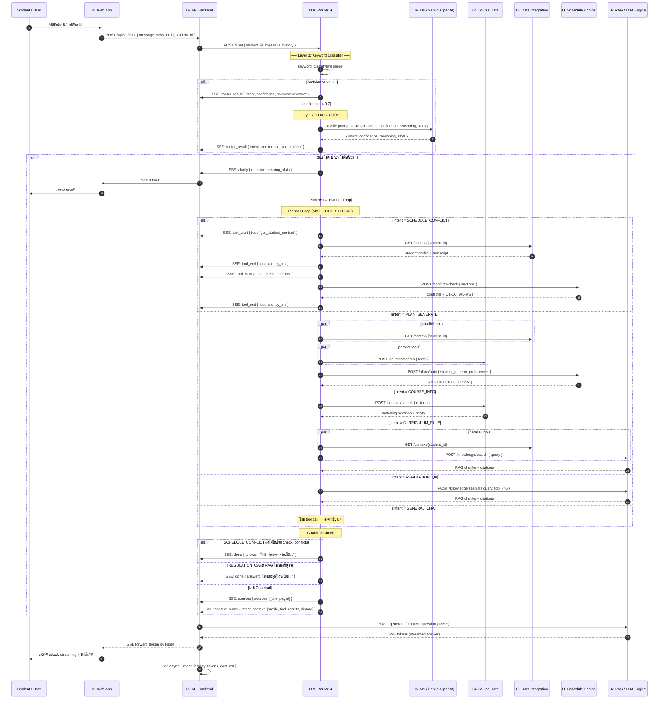
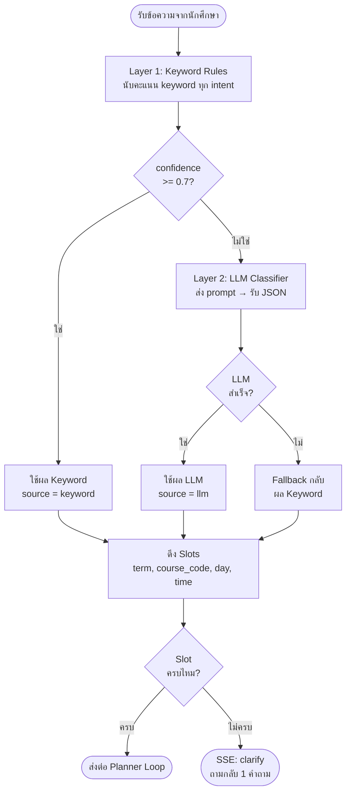
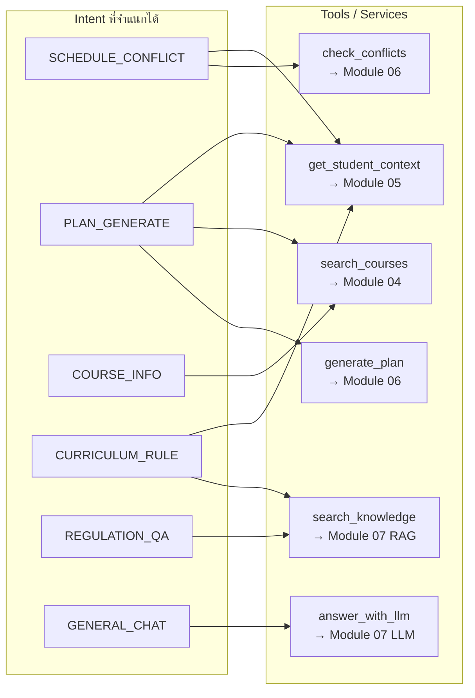

# 03 — AI Router / Agent

ระบบ **จับ intent + เลือก tool + คุม context** สำหรับระบบช่วยวางแผนการเรียน RMUTT  
รันบน **FastAPI** พอร์ต `8100` ภายใน Docker Compose

---

## ภาพรวม

AI Router / Agent คือ "สมองกลาง" ของระบบ ทำหน้าที่ 4 อย่าง:

1. **จำแนก Intent** — เข้าใจว่านักศึกษาต้องการอะไร (2 ชั้น: keyword → LLM)
2. **เลือกและเรียก Tools** — ตัดสินใจว่าจะใช้ service ไหน เรียงลำดับอย่างไร
3. **คุม Context** — จัดการ token budget ของประวัติการสนทนา
4. **ตรวจ Guardrail** — บังคับกฎ domain เช่น "ตารางชนต้องผ่าน engine เท่านั้น"

---

## โครงสร้างไฟล์

```
03_ai_router_agent/
├── src/
│   ├── config.py           # Settings จาก env vars (pydantic-settings)
│   ├── models.py           # Pydantic schemas: RouterRequest, RouterResponse, SSEEvent ...
│   ├── classifier.py       # 2-layer intent classifier (keyword → LLM)
│   ├── tools.py            # Tool Registry: 6 tools → HTTP calls ไปยัง services อื่น
│   ├── context_manager.py  # Token counting (tiktoken) + history trimming
│   ├── guardrails.py       # Hard rules: conflict ต้องผ่าน 06, ระเบียบต้องมี RAG
│   ├── planner.py          # Planner Loop: staged parallel tool execution
│   └── main.py             # FastAPI app: POST /chat (SSE), POST /classify, GET /health
├── 01_env.txt
├── 02_step.txt
├── 03_process.txt
├── Dockerfile
└── requirements.txt
```

---

## Sequence Diagram

### Flow หลัก: POST /chat (SSE Streaming)



---

### Flow ย่อย: Two-Layer Classifier



---

### Flow ย่อย: Planner Loop (Intent → Tool Map)



---

## Intents ที่รองรับ

| Intent | ตัวอย่างคำถาม | Tools ที่เรียก |
|---|---|---|
| `SCHEDULE_CONFLICT` | "ลงวิชา CPE101 ชนไหม?" | `get_student_context` → `check_conflicts` |
| `PLAN_GENERATE` | "จัดตารางเทอม 1/2569 ให้หน่อย" | `get_student_context` → `search_courses` → `generate_plan` |
| `COURSE_INFO` | "CPE201 เปิดกี่ section?" | `search_courses` |
| `CURRICULUM_RULE` | "เหลืออีกกี่หน่วยกิตถึงจะจบ?" | `get_student_context` + `search_knowledge` |
| `REGULATION_QA` | "ถอนรายวิชาได้ถึงเมื่อไหร่?" | `search_knowledge` (RAG) |
| `GENERAL_CHAT` | "สวัสดี / ขอบคุณ" | ส่งตรงไป Module 07 |

---

## SSE Event Types

ทุก response จาก `/chat` เป็น **Server-Sent Events** สตรีมออกมาตามลำดับนี้:

```
router_result   → intent, confidence, reasoning, slots
tool_start      → ชื่อ tool ที่กำลังจะเรียก
tool_end        → ชื่อ tool, success, latency_ms
sources         → รายการอ้างอิงจาก RAG (ถ้ามี)
context_ready   → context ก้อนรวมส่งต่อ Module 07
done            → latency_ms รวม
─── หรือ ───
clarify         → question กลับถามนักศึกษา (slot ไม่ครบ)
error           → ข้อความ error
```

---

## Guardrails

| กฎ | เงื่อนไข | พฤติกรรม |
|---|---|---|
| **G1** | `SCHEDULE_CONFLICT` แต่ไม่ได้เรียก `check_conflicts` | ปฏิเสธตอบ → แจ้งให้ระบุรหัสวิชา |
| **G2** | `REGULATION_QA` / `CURRICULUM_RULE` แต่ RAG ไม่มี chunk | ปฏิเสธตอบ → แนะนำติดต่อ สวท. |

> หลักการ: **LLM ห้ามเดาตัวเลขเวลาหรือระเบียบโดยไม่มีหลักฐาน**

---

## API Endpoints

| Method | Path | คำอธิบาย |
|---|---|---|
| `GET` | `/health` | Health check (Docker HEALTHCHECK) |
| `POST` | `/chat` | เส้นหลัก — SSE streaming |
| `POST` | `/classify` | Debug: จำแนก intent เท่านั้น (ไม่เรียก tool) |

### ตัวอย่าง Request Body (POST /chat)

```json
{
  "student_id": "65010001",
  "message": "ลง CPE101 กับ CPE201 ชนไหมครับ",
  "session_id": "sess_abc123",
  "history": [
    { "role": "user",      "content": "สวัสดี" },
    { "role": "assistant", "content": "สวัสดีครับ มีอะไรให้ช่วยไหม" }
  ]
}
```

### ตัวอย่าง SSE Response Stream

```
event: router_result
data: {"intent":"SCHEDULE_CONFLICT","confidence":0.88,"source":"keyword","slots":{"course_codes":["CPE101","CPE201"]}}

event: tool_start
data: {"tool":"get_student_context"}

event: tool_end
data: {"tool":"get_student_context","success":true,"latency_ms":45}

event: tool_start
data: {"tool":"check_conflicts"}

event: tool_end
data: {"tool":"check_conflicts","success":true,"latency_ms":120}

event: context_ready
data: {"intent":"SCHEDULE_CONFLICT","context":{...}}

event: done
data: {"latency_ms":215}
```

---

## Environment Variables

| Variable | Default | คำอธิบาย |
|---|---|---|
| `LLM_PROVIDER` | `gemini` | `gemini` / `openai` / `anthropic` |
| `LLM_API_KEY` | — | API key (ห้าม commit) |
| `LLM_MODEL` | `gemini-flash-lite-latest` | ชื่อโมเดลที่ใช้ classify |
| `LOCAL_MODEL_URL` | `http://local_ai:8300` | โมเดลในเครื่อง |
| `COURSE_DATA_URL` | `http://course_data:8400` | Module 04 |
| `DATA_INTEGRATION_URL` | `http://data_integration:8500` | Module 05 |
| `SCHEDULE_ENGINE_URL` | `http://schedule_engine:8600` | Module 06 |
| `RAG_LLM_URL` | `http://rag_llm:8700` | Module 07 |
| `MAX_TOOL_STEPS` | `5` | จำนวน tool call สูงสุดต่อ request |
| `MAX_CONTEXT_TOKENS` | `4000` | token budget ของ history |
| `TOOL_TIMEOUT_S` | `8.0` | timeout ต่อ tool call (วินาที) |
| `CONFIDENCE_THRESHOLD` | `0.7` | ค่าต่ำสุดที่ยอมรับจาก keyword layer |

---

## รันแบบ Standalone (ทดสอบโดยไม่มี services อื่น)

```bash
# 1. ติดตั้ง dependencies
cd 03_ai_router_agent
pip install -r requirements.txt

# 2. ตั้งค่า env
cp ../.env.example .env
#    แก้ LLM_PROVIDER, LLM_API_KEY, LLM_MODEL

# 3. รัน service
uvicorn src.main:app --host 0.0.0.0 --port 8100 --reload

# 4. ทดสอบ classify (ไม่เรียก tool)
curl -X POST http://localhost:8100/classify \
  -H "Content-Type: application/json" \
  -d '{"student_id":"test","message":"CPE101 ชนไหม","session_id":"s1","history":[]}'

# 5. health check
curl http://localhost:8100/health
```

---

## รันกับ Docker Compose (ระบบเต็ม)

```bash
# จาก root ของโปรเจกต์
docker compose up -d --build ai_router_agent

# ดู log
docker compose logs -f ai_router_agent
```

---

## ความสัมพันธ์กับ DL-06

| Concept | DL-06 (ต้นแบบ) | Module นี้ (ปรับเพิ่ม) |
|---|---|---|
| Two-layer classification | LLM ก่อน → keyword fallback | **Keyword ก่อน** → LLM เฉพาะเมื่อ conf < 0.7 |
| Structured JSON output | ✅ | ✅ `{ intent, confidence, reasoning, slots }` |
| Context window (tiktoken) | ✅ | ✅ + เพิ่ม plan_draft และ student profile |
| Routing | 3 routes (General/RAG/Local) | **6 intents** → 6 tool plans |
| Tool calling | abstract | **Named tool registry** 6 tools → service URLs |
| Planner loop | ไม่มี | ✅ `while step < MAX_TOOL_STEPS` (staged parallel) |
| Slot filling | ไม่มี | ✅ term, course_code, day, time + ask-back |
| Guardrails | กล่าวถึงทั่วไป | ✅ G1 conflict, G2 RAG evidence |
| SSE output format | กล่าวถึงทั่วไป | ✅ typed events: tool_start/end/sources/done |
| PDPA | ไม่มี | ✅ student hash ใน log |

---

> **เจ้าของ Module**: ใส่ชื่อใน `01_env.txt`  
> **Port**: 8100  
> **Sprint**: สัปดาห์ที่ 8 (ดู `00_docs/03_flow.md`)
